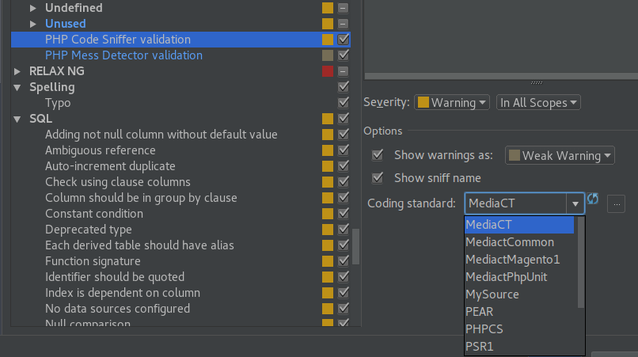

# MediaCT Coding Standard

This is the MediaCT coding standard.

## Installation

Use composer to install the coding standard in your home directory.

```shell
$ composer global config repositories.mediact composer https://composer.mediact.nl
$ composer global require mediact/coding-standard
```

## Configuring PHP CodeSniffer

When the coding standard is installed using composer it will also install
PHP CodeSniffer. To configure PHP CodeSniffer to find the new coding standard
execute the following command.

```shell
$ ~/.composer/vendor/squizlabs/php_codesniffer/scripts/phpcs \
  --config-set installed_paths ~/.composer/vendor/mediact/coding-standard/src
```

The setting works only for the phpcs command that has been executed to set the
config. If you execute another phpcs command on your computer (for example 
/usr/bin/phpcs) it will be ignored.

## Configuring PHPStorm to use the coding standard.

First configure PHPStorm to use the right phpcs command.

Go to __Settings > Languages & Frameworks > PHP > Code Sniffer__. Choose
"Local" for the path and fill in the full path to 
`~/.composer/vendor/squizlabs/php_codesniffer/scripts/phpcs`

Then go to __Settings > Editor > Inspections__ and search for PHP Code Sniffer
Validation. Push the refresh button next to the coding standards dropdown.
If PHP CodeSniffer has been configure correctly the MediaCT standards will be
shown. Choose MediaCT.



## Using the coding standard in a project

To use the standard in a project the standard needs to be required in composer.

```shell
$ cd <project_directory>
$ composer config repositories.mediact composer https://composer.mediact.nl
$ composer require mediact/coding-standard --dev
```

This will add the coding standard to the vendor directory of the project.

To let phpcs use the coding standard add a file phpcs.xml to the root of the
project.

```xml
<?xml version="1.0"?>
<ruleset>
    <rule ref="./vendor/mediact/coding-standard/src/MediaCT"/>
</ruleset>
```

The standard can be checked from the command line by going to the directory.

```shell
$ cd <project_directory>
$ ./vendor/squizlabs/php_codesniffer/scripts/phpcs ./src
```

## Configuring PHP CodeSniffer to also show less severe messages

By default PHP CodeSniffer shows only messages with a severity higher than
__5__. The MediaCT coding standard also has some messages with a lower
severity. These are messages that encourage a better way of coding but should
not block a pull request.

To configure phpcs to show also these messages execute the following command.

```shell
$ ~/.composer/vendor/squizlabs/php_codesniffer/scripts/phpcs \
  --config-set severity 1
```
